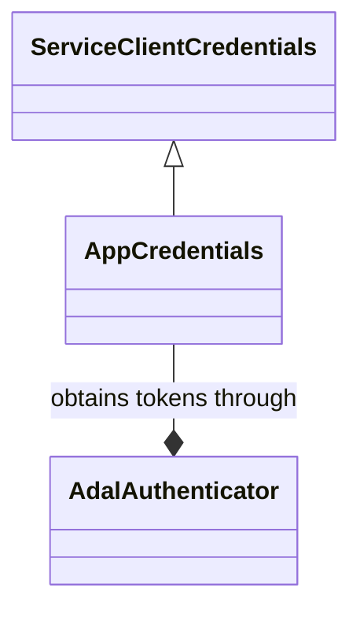

```mermaid
    classDiagram
        ServiceClientCredentials <|-- AppCredentials
        AppCredentials --* AdalAuthenticator: obtains tokens through
```
- `ServiceClientCredentials` is an MSREST interface