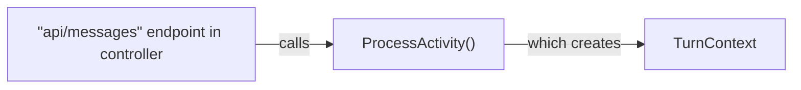
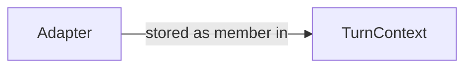
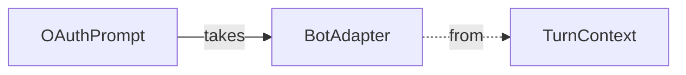
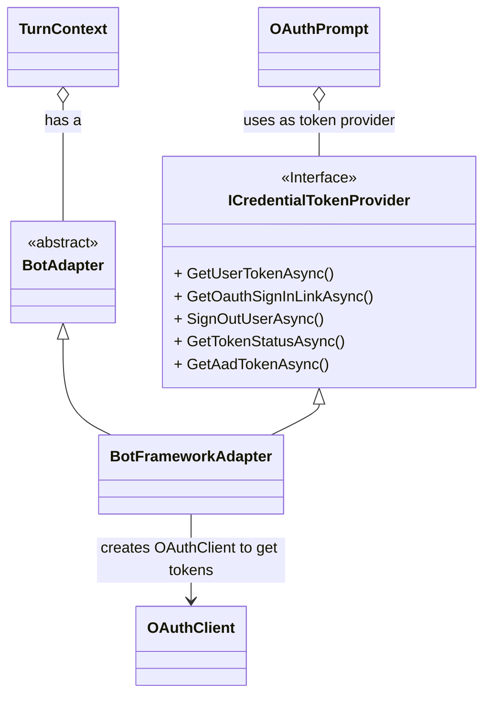
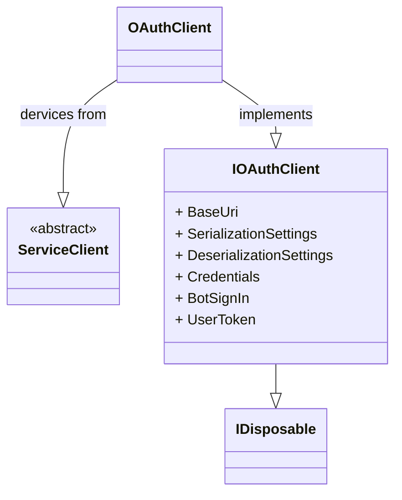
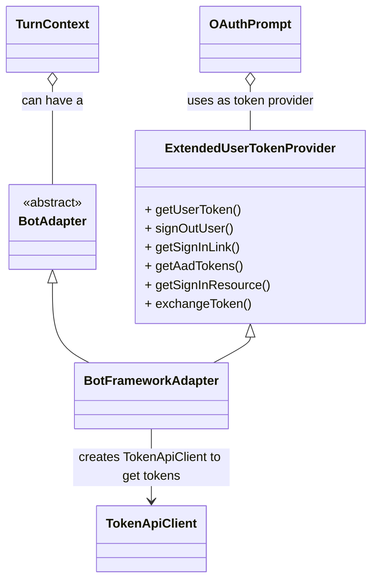
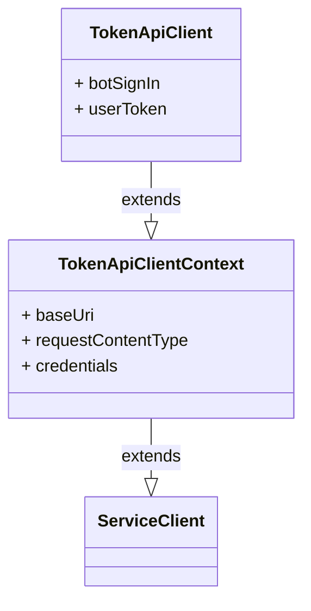

On `TurnContext` Initialization

`OAuthPrompt` has various methods* that uses `BotAdapter` within its logic:

* `OAuthPrompt` methods that use `BotAdapter`: `BeginDialogAsync()`, `GetUserTokenAsync()`, `SignUserOutAsync()`, `SendOAuthCardAsync()`, `RecognizeTokenAsync()`

### **Class Diagrams of `OAuthPrompt` and Their Token Provider**
- [C#](#c-token-provider-in-oauthprompt)
- [JS](#js-token-provider-in-oauthprompt)

#### **C#: Token Provider in `OAuthPrompt`:**

`OAuthPrompt` uses a `BotFrameworkAdapter` that implements `ICredentialTokenProvider` to acquire tokens.

#### `OAuthClient` Class Diagram

* `ServiceClient` is an MS Rest class.

#### **JS: Token Provider in `OAuthPrompt`:**

`OAuthPrompt` uses a `BotFrameworkAdapter` that implements `ExtendedUserTokenProvider` to acquire tokens.

#### `TokenApiClient` Class Diagram

* `TokenApiClient` and `TokenApiClientContext` are classes generated by auto-rest.
* `ServiceClient` is an [msrest class](https://github.com/Azure/ms-rest-js/blob/master/lib/serviceClient.ts).