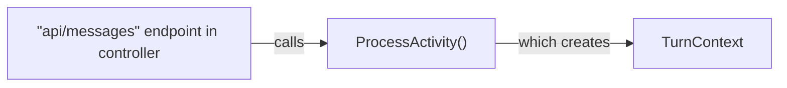
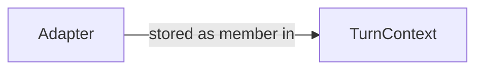
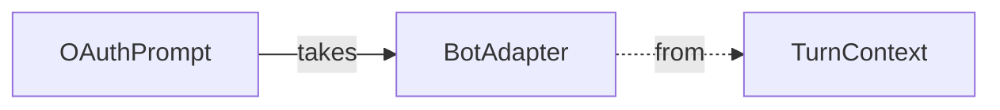

On `TurnContext` Initialization


`OAuthPrompt` has various methods* that uses `BotAdapter` within its logic:

* `OAuthPrompt` methods that use `BotAdapter`: `BeginDialogAsync()`, `GetUserTokenAsync()`, `SignUserOutAsync()`, `SendOAuthCardAsync()`, `RecognizeTokenAsync()`

`OAuthPrompt` uses a `BotFrameworkAdapter` to acquire tokens.

C#:
```mermaid
    classDiagram
        class OAuthPrompt

        class BotAdapter {
        }
        <<abstract>> BotAdapter

        class ICredentialTokenProvider {
            + GetUserTokenAsync()
            + GetOauthSignInLinkAsync()
            + SignOutUserAsync()
            + GetTokenStatusAsync()
            + GetAadTokenAsync()
        }
        <<Interface>> ICredentialTokenProvider

        class BotFrameworkAdapter {
            + GetUserTokenAsync()
        }

        OAuthPrompt o-- BotAdapter: uses as token provider
        BotAdapter <|-- BotFrameworkAdapter
        ICredentialTokenProvider <|-- BotFrameworkAdapter: C#: implements
        BotFrameworkAdapter *-- OAuthClient : creates OAuthClient to get tokens
```

JS:
```mermaid
    classDiagram
        class OAuthPrompt

        class BotAdapter {
        }
        <<abstract>> BotAdapter

        class ICredentialTokenProvider {
            + GetUserTokenAsync()
            + GetOauthSignInLinkAsync()
            + SignOutUserAsync()
            + GetTokenStatusAsync()
            + GetAadTokenAsync()
        }
        <<Interface>> ICredentialTokenProvider

        class BotFrameworkAdapter {
            + GetUserTokenAsync()
        }

        OAuthPrompt o-- BotAdapter: uses as token provider
        BotAdapter <|-- BotFrameworkAdapter
        ICredentialTokenProvider <|-- BotFrameworkAdapter: C#: implements
        BotFrameworkAdapter *-- TokenApiClient : creates TokenApiClient to get tokens
        TokenApiClientContext <|-- TokenApiClient: extends
        ServiceClient <|-- TokenApiClientContext
```

* `TokenApiClient` is a class generated by auto-rest
* `ServiceClient` is an msrest class